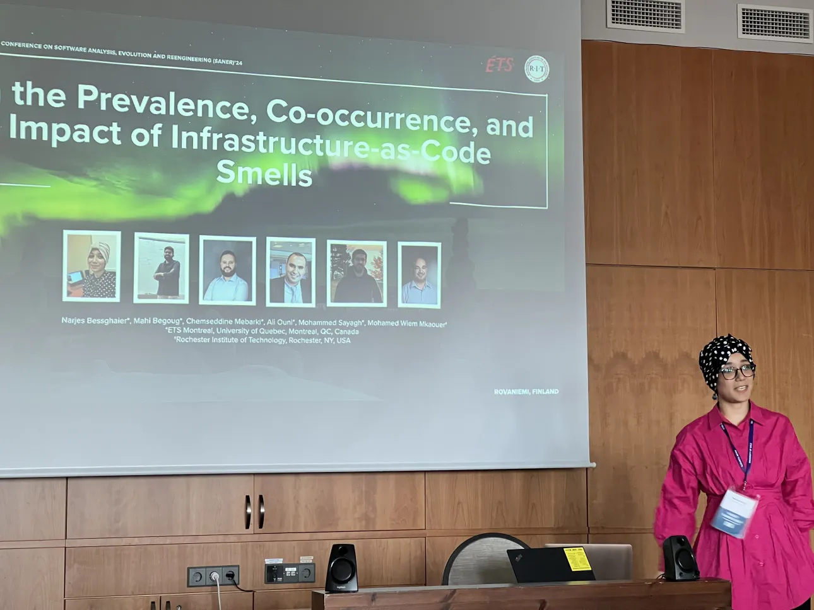

I am a Postdoctoral researcher at École de Technologie Supérieure (ÉTS) working with Pr. Imen Benzarti and Pr. Walid Maalej from University of Hamburg. My main research focuses on AI for User Experience Design. I hold a Ph.D. in Software Engineering from École de Technologie Supérieure (ÉTS), Canada (2025). My collaborations focus on AI-driven recommendation systems for Infrastructure-as-Code (IaC), with an emphasis on improving software quality, security, and developer productivity in DevOps environments. With over seven years of research experience, I authored 12 peer-reviewed publications in leading software engineering venues, including SANER, MSR, TOSEM, EMSE, JSS, and ESEM. I actively contribute to the research community through service on the program committee, as a reviewer for multiple conferences and journals, and by volunteering at various academic events. Throughout my academic career, I received multiple awards and been nominated for the PhD Excellence Award 2025. My long-term vision is to advance trustworthy and secure IaC automation practices at the intersection of software engineering and AI for DevOps.

 

  <strong>Research Interests</strong>
  <ul style="margin: 6px 0 0 18px; padding: 0;">
    <li>Requirements Engineering</li>
    <li>Experience Design</li>
    <li>User Cognitive</li>
    <li>Infrastructure-as-Code</li>
    <li>Software Configuration</li>
    <li>AI &amp; SE for DevOps</li>
    <li>Empirical Studies</li>
    <li>SBSE and ML for SE</li>
    <li>Code Review</li>
  </ul>

  
 
  <!-- Hero image -->
  <figure style="margin:18px 0 22px 0; padding:12px; border:1px solid #ddd; border-radius:14px;">
    
    <figcaption style="font-size:13px; color:#555; margin-top:8px;">
      SANER 2024 in Rovaniemi, Finland.
    </figcaption>
  </figure>
  

