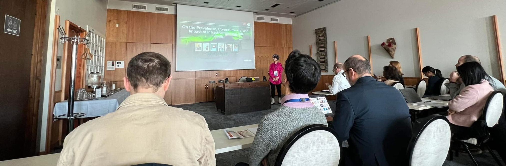

 <!-- Hero image -->
  <figure style="margin:18px 0 22px 0; padding:12px; border:1px solid #ddd; border-radius:14px;">
    
    <figcaption style="font-size:13px; color:#555; margin-top:8px;">
      SANER 2024 in Rovaniemi, Finland.
    </figcaption>
  </figure>
