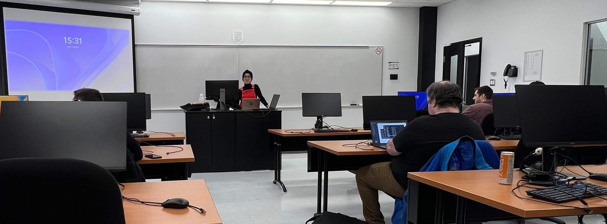

<article style="max-width:980px; margin:0 auto; font-family:Arial, Helvetica, sans-serif; color:#222; line-height:1.65;">

  <!-- Header -->
  <header style="margin:26px 0 18px 0;">
    

      Teaching Experience
    

  </header>

  <!-- Hero Image -->
  <figure style="margin:18px 0 24px 0; padding:12px; border:1px solid #ddd; border-radius:14px;">
    
    <figcaption style="font-size:13px; color:#555; margin-top:8px;">
      Teaching.
    </figcaption>
  </figure>

  <!-- Courses Section -->
  <section>

    <!-- Course 1 -->
    

      

        Course 1 — Programmation et réseautique en génie logiciel (LOG100)
      

      

        <strong>Role:</strong> Chargée de laboratoire
      

      

        Sessions: S2023, S2024, F2024
      

      

        Type: Undergraduate level
      

    

    <!-- Course 2 -->
    

      

        Course 2 — Réingénierie du logiciel (LOG530)
      

      

        <strong>Chargée de cours:</strong> W2025
      

      

        <strong>Chargée de laboratoire:</strong>
        W2023, W2024, W2025
      

      

        Type: Undergraduate level
      

    

    <!-- Course 3 -->
    

      

        Course 3 — Réalisation et maintenance de logiciels (MGL804)
      

      

        <strong>Role:</strong> Chargée de laboratoire
      

      

        Session: W2024
      

      

        Type: Graduate level
      

    

    <!-- Course 4 -->
    

      

        Course 4 — Programmation orientée objet (hors programme) (INF111)
      

      

        <strong>Role:</strong> Chargée de laboratoire
      

      

        Session: W2026
      

      

        Type: Undergraduate level
      

    

    <!-- Course 5 -->
    

      

        Course 5 — Introduction à la programmation (INF155)
      

      

        <strong>Role:</strong> Chargée de laboratoire
      

      

        Session: W2026
      

      

        Type: Undergraduate level
      

    

  </section>

</article>
