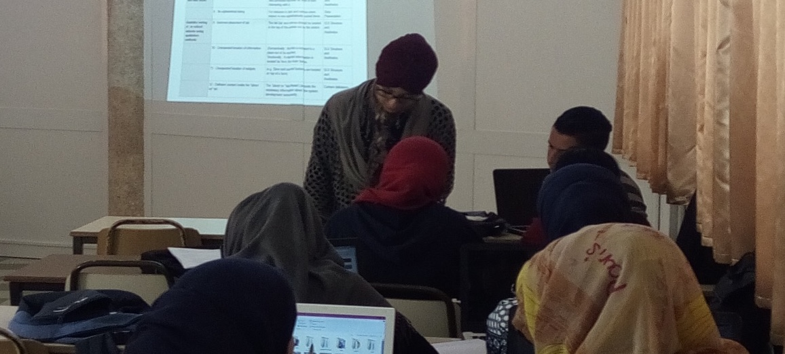

<article style="max-width:980px; margin:0 auto; font-family:Arial, Helvetica, sans-serif; color:#222; line-height:1.65;">

  <!-- Hero Image -->
  <figure style="margin:18px 0 24px 0; padding:12px; border:1px solid #ddd; border-radius:14px;">
    
    <figcaption style="font-size:13px; color:#555; margin-top:8px;">
      Teaching activities at the Higher Institute of Management (ISG), Gabes.
    </figcaption>
  </figure>

  <section>

    <!-- Course 1 -->
    

      

        Course 1 — Traitement de texte
      

      

        <strong>Program:</strong> 2ème Année Licence Fondamentale IAG (Undergraduate)
      

      

        <strong>Role:</strong> Assistant – vacataire
      

      

        Session: W2018
      

    

    <!-- Course 2 -->
    

      

        Course 2 — Tech-Multimedia
      

      

        <strong>Program:</strong> 1ère Année Licence Appliquée IAG/EC (Undergraduate)
      

      

        <strong>Role:</strong> Assistant – vacataire
      

      

        Session: S2018
      

    

    <!-- Course 3 -->
    

      

        Course 3 — Atelier de programmation JAVA
      

      

        <strong>Program:</strong> 2ème Année Licence Fondamentale IAG (Undergraduate)
      

      

        <strong>Role:</strong> Assistant – vacataire
      

      

        Session: S2019
      

    

  </section>

</article>

