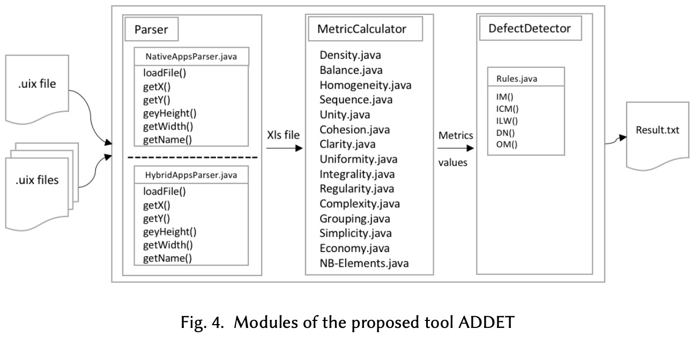

## Synopsis:

Androis apps user interfaces need to be free fromall kinds of structural aesthetic defects. 
Such defects are indicators of poor design decisions interfering withthe consistency of a MUI and making it more difficult to use. 
To this end, we are proposing a tool (ADDET) to determine the structural aesthetic dimension of MUIs. 
Automating this process is useful to designers inevaluating the quality of their designs. Our approach is composed of two modules.

1) Metrics assessment: is based on the static analysis of a tree-structured layout of the MUI. 
We used 15 geometric metrics (also knownas structural or aesthetic metrics) to check various structural properties before a defect is triggered; 

2) Defects detection: the manual combination of metrics and defects are time-consuming and user-dependent when determining a detection rule. Thus, we perceive the process of identification of defects as an optimization problem. 

Download ADDET [parser](https://github.com/NarjessBessghaier/Defects_Detection_Tool) and start evaluating your Android apps UIs.
