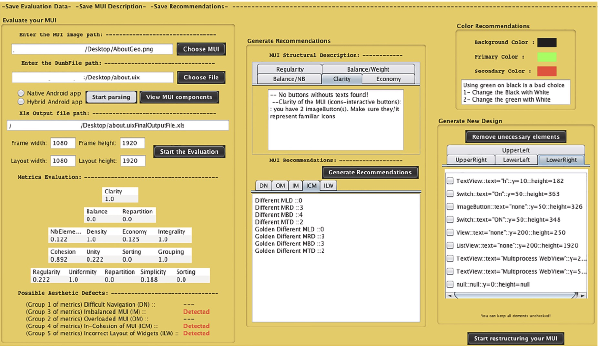
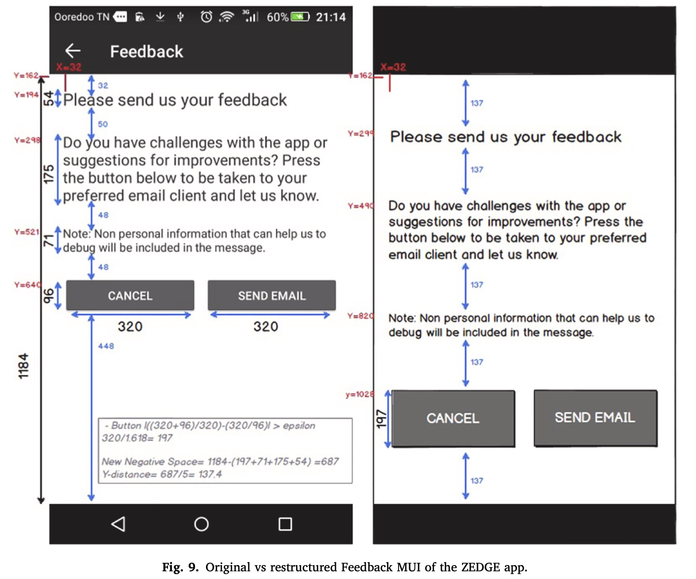

## Synopsis:

We present in this study an automated approach for restructuring a user interface structural design based on its
data model. Our framework checks the violation of 13 generic structural design standards provided by Google
Material Design. Then, the framework provides a set of recommendations for each violated guideline based on
the specifications of the evaluated MUI. As a proof of concept, we used the tool ADDET to evaluate the quality of
the original and restructured versions of 511 user interfaces in terms of the number of aesthetic defects and
aesthetic properties. The results revealed a significant positive difference with a mean of 0.59 for the benefit of
restructured user interfaces with an improved set of 7 quality metrics. We have also found that our approach
could improve to an extent the accessibility of some designs by providing bigger element sizes.

Watch a snippet of the framework on Youtube: [Framework](https://www.youtube.com/watch?v=Se3ZCDsPXEU)
