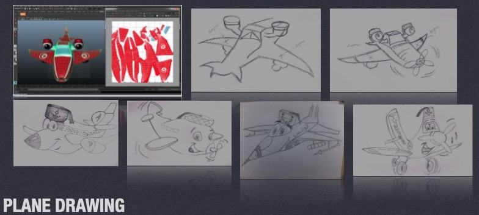
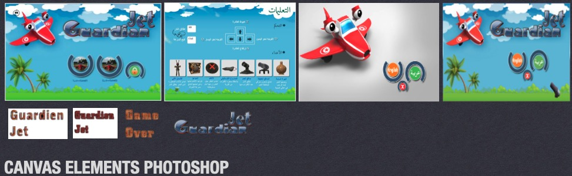
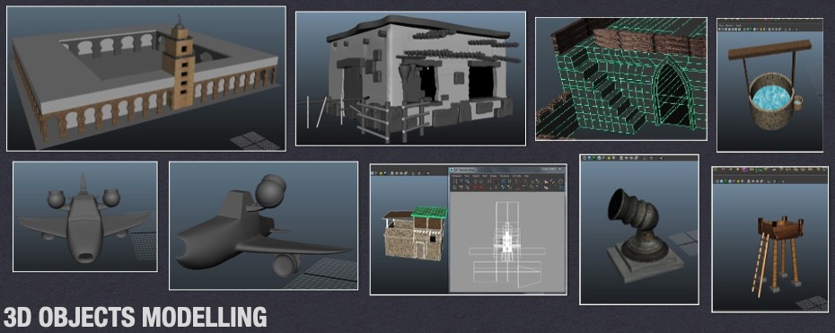
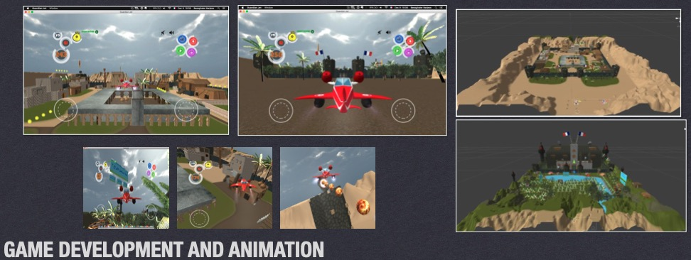
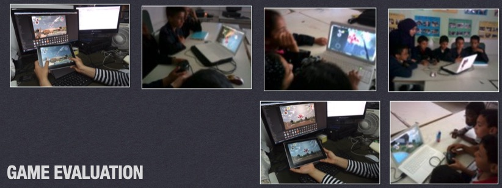

## 3D Educational Video Game

* B.S. in Computer science applied to Management
  - Thesis: Guardian Jet - Un jeu vidéo en 3D
  - Higher Institute of Management of Gabes, Tunisia, 2015

Developed an educational 3D video game using Autodesk Maya 2015 for 3D modeling, Unity for game development and animation, and Adobe Photoshop for creating canvas elements.

#### Step 1: Drawing different plane models

#### Step 2: Creating canvas elements using Photoshop

#### Step 3: Creating 3D objects using Maya

#### Step 4: Developing the game using Unity3D

#### Step 5: Evaluating the game with middle school students

Download the game on Windows and Mac (it wont work on M1, M2 ships): [Guardian Jet](https://drive.google.com/drive/folders/1CSrYVe97ZvMtAqk9XwDNyMDWM1zPjUDg?usp=share_link)

