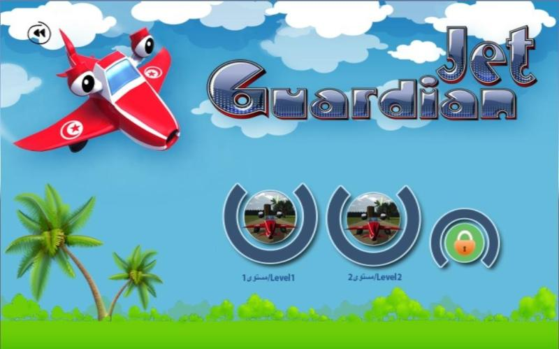

 

* Degree: B.S. in Computer science applied to Management
  - Thesis: Guardian Jet - Un jeu vidéo en 3D
  - Affiliation: Higher Institute of Management of Gabes, Tunisia
  - Period: 2014-1015
  - Supervisor: Dr, Iskander Keskes
  - Engineer: Ing, [Raouf Bessghaier](https://www.linkedin.com/in/bessghaier-raouf/)
  - Place: Palm 3D Studio
  - Software: Autodesk Maya 2015 for 3D modeling, Unity for game development and animation, and Adobe Photoshop for creating canvases elements.

- Story behind the game: I developed an educational 3D video game focused on the French colonization of Tunisia. The game consists of two interactive maps, each featuring educational questions related to the historical period. These questions appear on floating canvases, and players must shoot bullets at the correct answers to progress. Additionally, when players approach specific artifacts—such as jars, mines, or gates—a brief narrative is triggered, providing historical context about how these items were used during the colonial era. Each map also includes combat challenges, where players must shoot a set of enemies and collect gold. The player controls a miniature aircraft emblazoned with the Tunisian flag. The aircraft’s small scale—designed at a 1:10 ratio relative to other in-game objects—adds an extra layer of difficulty, enhancing the game's immersive dimension.

#### Step 1: Drawing different plane models

#### Step 2: Creating canvas elements using Photoshop

#### Step 3: Creating 3D objects using Maya

#### Step 4: Developing the game using Unity3D

#### Step 5: Evaluating the game with middle school students

Watch a snippet of the game on Youtube: [Guardian Jet Video](https://www.youtube.com/watch?v=AfkVj9_Abb0)

Download the game on Windows and Mac (it wont work on M1, M2 ships): [Guardian Jet Game](https://drive.google.com/drive/folders/1CSrYVe97ZvMtAqk9XwDNyMDWM1zPjUDg?usp=share_link)

